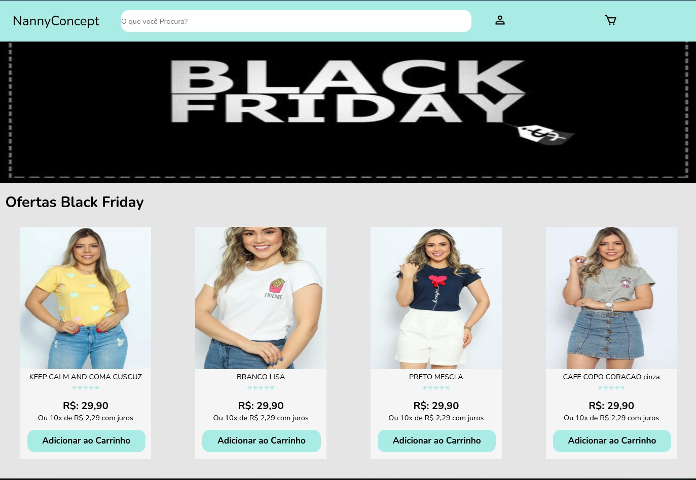

<h2>Landing Page ecommerce</h2>

<h3>Apresentação do Projeto</h3>



<h3>Descrição</h3>

<p>Projeto desenvolvido por um desafio proposto pelo Hiring Coders, uma landing page de ecommerce, com localStorage para nome e e-mail</p>

## :rocket: Tecnologias

- [React](https://pt-br.reactjs.org/)
- [Javascript](https://developer.mozilla.org/pt-BR/docs/Web/JavaScript)
- [HTML5](https://developer.mozilla.org/pt-BR/docs/Web/HTML/HTML5)
- [SASS](https://sass-lang.com/)

<div id="requisitos">

## :white_check_mark: Requisitos

<p>Antes de executar :checkered_flag:, você precisar ter o <a href="https://git-scm.com">[Git]</a> e o <a href="https://nodejs.org/pt-br/">[Node]</a> instalados.</p>

## :checkered_flag: Executando

```bash

# Clone este projeto
$ git clone https://github.com/guisantanaa/black-friday-ecommerce

# Entre na pasta teste-corebiz-ecommerce
$ cd black-friday-ecommerce
$ Execute o comando 'code .' e o projeto sera aberto no Visual Studio Code

# Instale as dependências
$ yarn

# Inicialize
$ yarn start

# Uma página sera aberta em http://localhost:3000

```

<h3>Link de deploy</h3>
<a href="https://black-friday-ecommerce.vercel.app/">Link</a>
